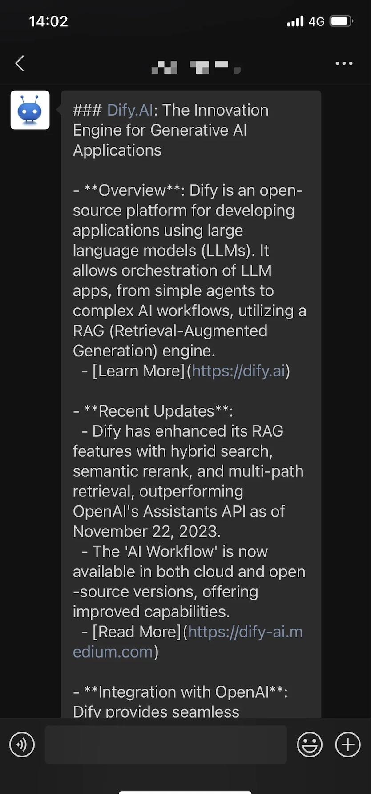

# ⏰ Dify Schedule Helper

> Author:[Leo_chen](https://github.com/leochen-g) 

> [X(Twitter)](https://x.com/leochen_code)

Tired of manually running your Dify workflows? Let's add some automation magic! 

✨ The Dify Schedule Helper brings you the power of scheduled tasks - a feature not available in the official Dify platform. Using GitHub Actions, you can now schedule your workflows to run automatically and get instant notifications about their execution.

## 🎯 What Can It Do?

- 🔄 Automatically execute multiple Dify workflows on schedule
- ⏰ Run tasks at your preferred time (default: 06:30 Beijing Time)
- 📱 Send notifications through various channels
- 🆓 Completely free to use
- 🔒 Secure and reliable with GitHub Actions

## 🚀 Getting Started

You can use this automation in two ways:
- 🌐 Quick Start (Cloud-based)

### 🌐 Quick Start

Let's get your automated workflows up and running in just a few steps!

1. 🍴 First, [Fork the repository](https://github.com/leochen-g/dify-schedule)

2. ⚙️ Set up your secrets:
   Navigate to: Repository Settings -> Secrets -> New repository secret

   | Secret Name | What to Put | Required? |
   |------------|-------------|-----------|
   | DIFY_BASE_URL | Your Dify API URL (default: https://api.dify.ai/v1) | No |
   | DIFY_TOKENS | Your Dify workflow API keys (use `;` to separate multiple keys) | Yes |
   | DIFY_INPUTS | JSON format workflow variables (if required by your Dify setup) | No |
   
   ### 📱 Notification Settings (Optional but recommended!)
   
   | Secret Name | What to Put | For |
   |------------|-------------|-----|
   | EMAIL_USER | SMTP-enabled email address | Email notifications |
   | EMAIL_PASS | SMTP password | Email notifications |
   | EMAIL_TO | Recipient email(s) (use `, ` for multiple) | Email notifications |
   | PUSHPLUS_TOKEN | [Pushplus](http://www.pushplus.plus/) token | WeChat notifications |
   | SERVERPUSHKEY | [Server酱](https://sct.ftqq.com/) key | WeChat notifications |
   | DINGDING_WEBHOOK | DingTalk robot webhook | DingTalk notifications |
   | WEIXIN_WEBHOOK | WeCom robot webhook | WeCom notifications |
   | FEISHU_WEBHOOK | Feishu robot webhook | Feishu notifications |
   | AIBOTK_KEY | [AI Secretary](https://wechat.aibotk.com?r=dBL0Bn&f=difySchedule) apikey | WeChat notifications |
   | AIBOTK_ROOM_RECIVER | Group chat name for AI Secretary | WeChat group notifications |
   | AIBOTK_CONTACT_RECIVER | Contact name for AI Secretary | WeChat private notifications |

3. ▶️ Enable the workflow:
   Go to Actions tab and enable the workflows

## 📸 Preview

| WeChat Notification | Email Notification |
|:------------------:|:------------------:|
|  |  |

## ❓ FAQ

### 🔑 How to get Dify workflow tokens?

1. Open your Dify dashboard
2. Navigate to your workflow application
3. Go to API Reference
4. Copy your API Key

> 💡 Note: Only workflow applications are supported!

### 🚫 Connection Issues?

If you're using a self-hosted Dify instance, make sure it's accessible from the public internet - GitHub Actions needs to reach your server!

### ❌ Execution Errors?

1. 🔍 Check if your application is a workflow application
2. ⚙️ If your workflow requires input variables, configure `DIFY_INPUTS` with valid JSON
3. 📝 Read the error logs carefully and ensure all required variables are set correctly

Need more help? Feel free to open an issue with your logs (remember to remove sensitive information)! 